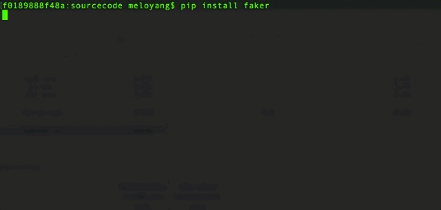
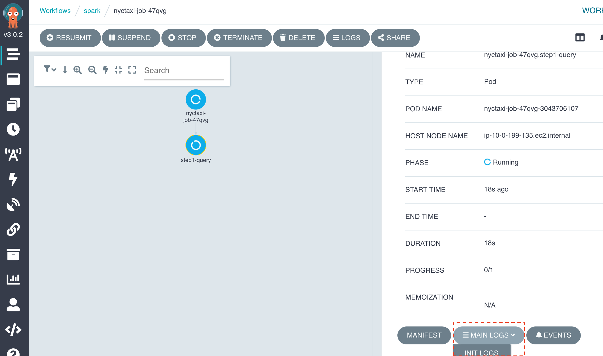
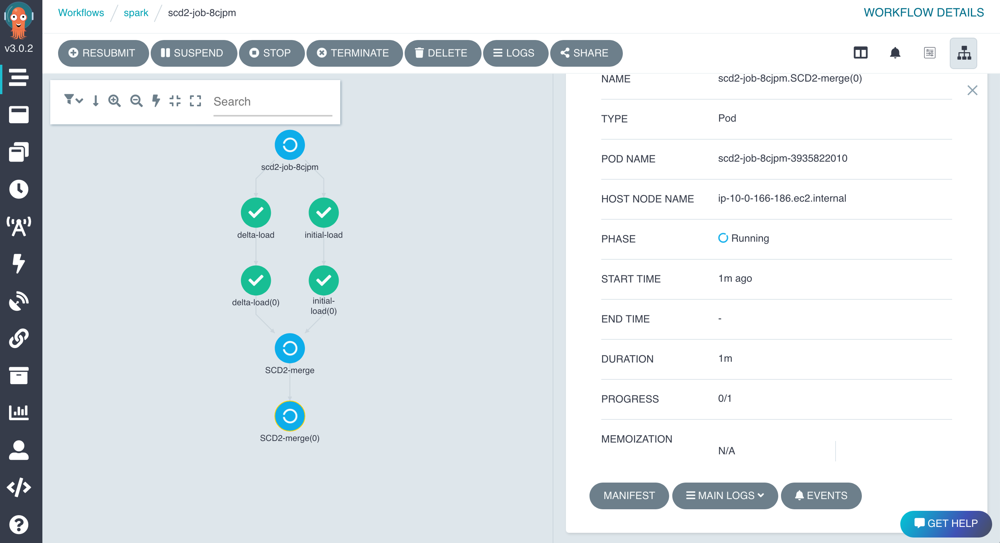
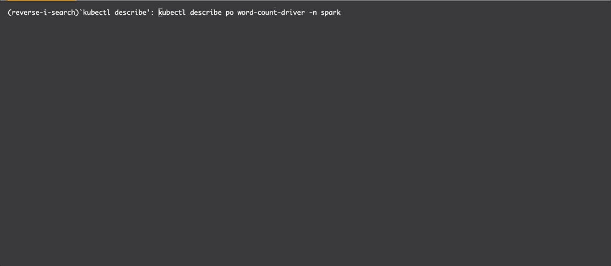
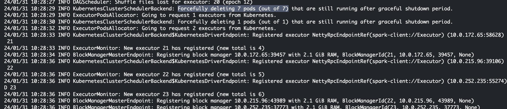
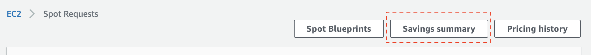
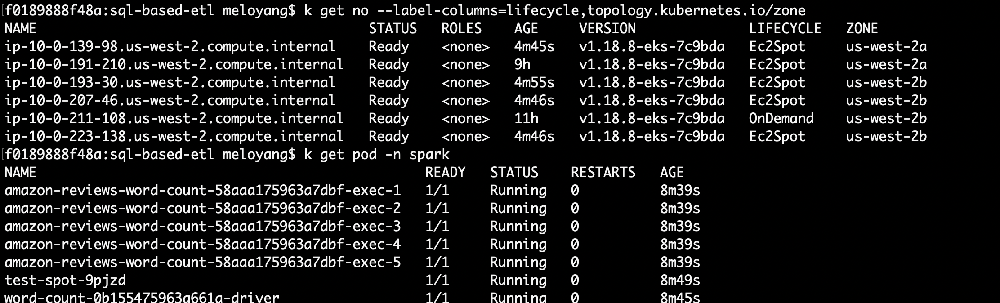

# Guidance for SQL-Based Extraction, Transformation and Loading with Apache Spark on Amazon EKS
## Overview

The 'SQL-Based Extraction, Transformation and Loading with Apache Spark on Amazon EKS' guidance provides [declarative](https://en.wikipedia.org/wiki/Declarative_programming) data processing support, codeless extract-transform-load (ETL) capabilities, and [workflow orchestration ](https://www.prefect.io/blog/intro-to-workflow-orchestration) automation to help business users (such as analysts and data scientists) access their data and create meaningful insights without a need for manual IT processes.

This guidance abstracts common ETL activities, including formatting, partitioning, and transforming datasets, into configurable and productive data processes. This abstraction results in actionable insights derived more quickly to help you accelerate your data-driven business decisions. Additionally, this guidance uses an open-source Arc data processing framework, run on Amazon Elastic Kubernetes Service [(Amazon EKS)](https://aws.amazon.com/eks/) and powered by [Apache Spark](https://spark.apache.org/) and container technologies, to simplify Spark application development and deployment.

This guidance uses [GitHub](https://github.com/) as the source repository to track ETL asset changes, such as Jupyter notebook scripts and SQL script updates, allowing for application version control and standardized continuous integration and continuous delivery (CI/CD) deployments. It unifies analytical workloads and IT operations using standardized and automated processes, providing a simplified ETL deployment management capability for your organization’s DevOps team. These automated processes help you avoid unintentional human mistakes caused by manual, repetitive tasks.

### Features and benefits

The Guidance for SQL-Based Extraction, Transformation and Loading with Apache Spark on Amazon EKS offers the following features:

-	**Built, test, and debug ETL jobs in Jupyter**: Use [JupyterHub](https://z2jh.jupyter.org/en/latest/), a web-based interactive integrated development environment (IDE) to simplify your ETL development experience. It includes a custom [Arc kernel](https://arc.tripl.ai/getting-started/#notebook) that enables you to define each ETL task or stage in separate blocks. The execution of each block produces data results and a task log. The log captures real-time data processing status and exception messages that can be valuable for debugging.

-	**Use a SQL-first approach**: Implement business logic and data quality checks in ETL pipeline development using [Spark SQL](https://spark.apache.org/docs/latest/sql-ref.html). You can process and manipulate data in Spark using your existing SQL expertise.

-	**Orchestrate jobs without code**: Use [Argo workflows](https://argo-workflows.readthedocs.io/en/latest/) to schedule jobs and manage complex job run dependencies without the need to code. Argo workflows allows you declaratively define job implementation target state, orders, and relationships. It provides a user-friendly graphical dashboard to help you track workflow status and resource usage patterns. The job orchestration tool in this guidance is a switchable plug-in and can be replaced by another tool of your choice, for example Apache Airflow or Volcano.

-	**Auto-deploy Docker images**: Set up an AWS continuous improvement and continuous development (CI/CD) pipeline to securely store the guidance's Arc Docker image in Amazon Elastic Container Registry ([Amazon ECR](https://aws.amazon.com/ecr/)).

-	**Automate ETL artifact deployment**: Integrate the Jupyter IDE with the guidance GitHub repository to detect the state of an ETL application change. As a one-off setup with your choice of CI/CD tool, a GitHub change activates a file sync-up process between your repository and the artifact store of [Amazon S3](https://aws.amazon.com/s3/) bucket. As a result, Argo Workflows can refer to the latest or versioned application assets in S3, such as a Jupyter notebook (ETL job specification) file, then orchestrate an ETL job run either on-demand or based on a time or an event.

### Use cases

Driven by the modern [Data Lake](https://aws.amazon.com/what-is/data-lake/) architecture, data engineers usually have to implement formatting, partitioning, and transforming of datasets, before making data available to data analysts and data scientists, so that they can start to produce insights for business with well-formed data. For organisations that are operating on SQL based data management systems or tools, adapting to a modern data lake practice with Apache Spark technology slows down the progress of data to insight. Increasingly, business's success depends on its agility in transforming data into actionable insights, which requires efficient and automated data processes. The gap between data consumption requirements and low-level data engineering activities is addressed by this AWS Guidance. 

To accelerate data innovation with faster time to insight, this AWS guidance provides you a codeless extract-transform-load (ETL) option driven by a SQL centric architecture. By leveraging [an open-source data framework (Arc)](https://arc.tripl.ai/) powered by Apache Spark and Container technologies, it enables our customers to build a modern data guidance on an AWS managed container service with ease of use. Additionally, if you want to take advantage of an optimized [Amazon EMR](https://aws.amazon.com/emr/) runtime for Apache Spark plus other features offered EMR, the Arc framework can be utilized in Amazon EMR on Amazon EKS deployment option with no code changes. 

## Architecture overview

This section provides an architecture diagram and describes the components deployed with this Guidance.

### Architecture diagram

 </img>

*Figure 1: Architecture of SQL-Based Extraction, Transformation and Loading with Apache Spark deployed on Amazon EKS*

### Architecture steps

1. Users interact with ETL development and orchestration tools via [Amazon CloudFront](https://aws.amazon.com/cloudfront/) endpoints with [Application Load Balancer](https://aws.amazon.com/elasticloadbalancing/application-load-balancer/) origins, which provide secure connections between clients and ETL tools’ endpoints.
2. Users perform ETL jobs processing batch or stream data via [Amazon VPC endpoints](https://docs.aws.amazon.com/whitepapers/latest/aws-privatelink/what-are-vpc-endpoints.html). The traffic between ETL processes and data stores goes through VPC endpoints  without leaving the AWS network.
3. The [JupyterHub](https://jupyter.org/hub) IDE integrates with the guidance GitHub repository to track ETL asset changes. Those ETL assets include Jupyter notebooks (job definition files) and SQL scripts (to be run against [Amazon Athena](https://aws.amazon.com/athena))
4. ETL assets from GitHub are uploaded into the guidance artifacts’ [Amazon S3](https://aws.amazon.com/s3/) bucket. That synchronization process can be implemented by an automated CI/CD deployment process triggered by assets’ updates in GitHub or performed manually.
5. Updates to Docker build asset in GitHub public container registry activate an [AWS CodeBuild](https://aws.amazon.com/codebuild/) /[AWS CodePipeline](https://aws.amazon.com/codepipeline) CI/CD pipeline to automatically build and push the Arc ETL Framework container image to [Amazon Elastic Container registry (ECR)](https://aws.amazon.com/ecr).  
6. Users schedule ETL jobs via Argo Workflows to be run on [Amazon Elastic Kubernetes Service (EKS)](https://aws.amazon.com/eks/). These jobs automatically pull Arc Docker image from ECR, download ETL assets from the artifact S3 bucket, and send application execution logs to Amazon CloudWatch. Access to all the AWS services are secured via VPC endpoints.
7. JupyterHub IDE automatically retrieves login credentials from [Amazon Secrets Manager](https://aws.amazon.com/secrets-manager/) to validate sign-in requests from users who can then run their Jupyter notebook code in that environment and get results.

### AWS services used  in this Guidance

| **AWS service**  | Description |
|-----------|------------|
|[Amazon Elastic Kubernetes Service (EKS)](https://aws.amazon.com/eks/)|Core service - The EKS service is used to host the guidance workloads|
|[Amazon Elastic Compute Cloud](https://aws.amazon.com/ec2/)| Core Service - EC2 instance power On Demand and Spot based EKS compute node groups for running container workloads|
|[Amazon Elastic Container Registry](https://aws.amazon.com/ecr/)|Core service - ECR registry is used to host the container images for Spark jobs and Arc ETL Framework|
|[Amazon EMR on EKS](https://aws.amazon.com/emr/features/eks/)| Auxiliary service - alternative way to configure and run ETL Jobs on EKS| 
|[Amazon Athena](https://aws.amazon.com/athena/)| Core service - used for SQL syntax Querying of Sample ETL job results from S3|
|[AWS Glue Data Catalog](https://docs.aws.amazon.com/glue/latest/dg/components-overview.html#data-catalog-intro)| Auxiliary service - exposes ETL related data stores |
|[Amazon S3](https://aws.amazon.com/s3/)|Core service - Object storage for users' ETL assets from GitHub|
|[Amazon CloudFront](https://aws.amazon.com/cloudfront/)|Auxiliary service - provides SSL entrypoints for Jupyter and Argo Workflows tools |
|[Amazon CloudWatch](https://aws.amazon.com/cloudwatch/)|Auxiliary service - provides observability for core services  |
|[AWS Secretes Manager](https://aws.amazon.com/secrets-manager/)|Auxiliary service - provides user credentials management for Jupyter IDE |
|[AWS CodeBuild](https://aws.amazon.com/codebuild/)| Core service - CI/CD automation for building Arc ETL framework images  |
|[AWS CodePipeline](https://aws.amazon.com/codepipeline)| Core service - CI/CD automation for pushing Arc ETL framework images into ECR registry|

### Original README Content below - to review
#### Table of Contents
* [Prerequisites](#Prerequisites)
* [Deploy Infrastructure](#Deploy-infrastructure)
  * [CFN Deploy](#Deploy-CFN)
  * [Customization](#Customization)
  * [CDK Deploy](#Deploy-via-CDK)
  * [Troubleshooting](#Troubleshooting)
* [Post Deployment](#Post-Deployment)
  * [Test ETL job in Jupyter Notebook](#Test-job-in-Jupyter-notebook)
  * [Submit & Orchestrate Job](#Submit--orchestrate-job)
    * [Submit on Argo UI](#Submit-a-job-on-argo-ui)
    * [Submit by Argo CLI](#Submit-a-job-by-argo-cli)
    * [Submit a Native Spark Job](#Submit-a-native-job-with-spark-operator)
      * [Execute a PySpark Job](#Execute-a-pyspark-job)
      * [Self-recovery Test](#Self-recovery-test)
      * [Cost Savings with Spot](#Check-Spot-instance-usage-and-cost-savings)
      * [Autoscaling & Dynamic Resource Allocation](#Autoscaling---dynamic-resource-allocation)
* [Useful commands](#Useful-commands)  
* [Clean Up](#clean-up)
* [Security](#Security)
* [License](#License)

## Prerequisites 
1. Python 3.6 or later. Download Python [here](https://www.python.org/downloads/).
2. AWS CLI version 1.
  Windows: [MSI installer](https://docs.aws.amazon.com/cli/latest/userguide/install-windows.html#install-msi-on-windows)
  Linux, macOS or Unix: [Bundled installer](https://docs.aws.amazon.com/cli/latest/userguide/install-macos.html#install-macosos-bundled)
3. The AWS CLI can communicate with services in your deployment account. Otherwise, run the following script to setup your AWS account access from a command line tool.
```bash
aws configure
```
## Deploy Infrastructure

Download the project:
```bash
git clone https://github.com/awslabs/sql-based-etl-with-apache-spark-on-amazon-eks.git
cd sql-based-etl-with-apache-spark-on-amazon-eks
```

This project is set up like a standard Python project. The `source/cdk.json` file tells where the application entry point is. The provisioning takes about 30 minutes to complete. See the `troubleshooting` section if you have any deployment problem. 

Two ways to deploy:
1. AWS CloudFormation template (CFN) 
2. [AWS Cloud Development Kit (AWS CDK)](https://docs.aws.amazon.com/cdk/latest/guide/home.html).

[*^ back to top*](#Table-of-Contents)
### Deploy CFN


  |   Region  |   Launch Template |
  |  ---------------------------   |   -----------------------  |
  |  ---------------------------   |   -----------------------  |
  **us-east-1**| [](https://console.aws.amazon.com/cloudformation/home?region=us-east-1#/stacks/quickcreate?stackName=SparkOnEKS&templateURL=https://blogpost-sparkoneks-us-east-1.s3.amazonaws.com/sql-based-etl/aws-solution-v2/sql-based-etl-with-apache-spark-on-amazon-eks.template) 

* Option1: Deploy with default (recommended). The default region is **us-east-1**. 
To launch the solution in a different AWS Region, deploy the solution by following the `Customization` section. 

* Option2: To ETL your own data, input the parameter `datalakebucket` by your S3 bucket. 
`NOTE: the S3 bucket must be in the same region as the deployment region.`

### Customization
You can customize the solution, such as remove a Jupyter timeout setting, then generate the CFN in your region: 
```bash
export BUCKET_NAME_PREFIX=<my-bucket-name> # bucket where the customized CFN templates will reside
export AWS_REGION=<your-region>
export SOLUTION_NAME=sql-based-etl
export VERSION=aws-solution-v2 # version number for the customized code

./deployment/build-s3-dist.sh $BUCKET_NAME_PREFIX $SOLUTION_NAME $VERSION

# create the bucket where customized code will reside
aws s3 mb s3://$BUCKET_NAME_PREFIX-$AWS_REGION --region $AWS_REGION

# Upload deployment assets to the S3 bucket
aws s3 cp ./deployment/global-s3-assets/ s3://$BUCKET_NAME_PREFIX-$AWS_REGION/$SOLUTION_NAME/$VERSION/ --recursive --acl bucket-owner-full-control
aws s3 cp ./deployment/regional-s3-assets/ s3://$BUCKET_NAME_PREFIX-$AWS_REGION/$SOLUTION_NAME/$VERSION/ --recursive --acl bucket-owner-full-control

echo -e "\nIn web browser, paste the URL to launch the template: https://console.aws.amazon.com/cloudformation/home?region=$AWS_REGION#/stacks/quickcreate?stackName=SparkOnEKS&templateURL=https://$BUCKET_NAME_PREFIX-$AWS_REGION.s3.amazonaws.com/$SOLUTION_NAME/$VERSION/sql-based-etl-with-apache-spark-on-amazon-eks.template\n"
```

[*^ back to top*](#Table-of-Contents)
### Deploy via CDK

CDK deployment requires Node.js (>= 10.3.0) and AWS CDK Toolkit. To install Node.js visit the [node.js](https://nodejs.org/en/) website. To install CDK toolkit, follow the [instruction](https://cdkworkshop.com/15-prerequisites/500-toolkit.html). If it's the first time to deploy an AWS CDK app into an AWS account, also you need to install a [“bootstrap stack”](https://cdkworkshop.com/20-typescript/20-create-project/500-deploy.html) to your CloudFormation.

See the `troubleshooting` section, if you have a problem to deploy the application via CDK.
 
Two reasons to deploy the solution by AWS CDK:
1. CDK provides local debug feature and fail fast.
2. Convenient to customize the solution with a quicker test response. For example remove a nested stack CloudFront and enable TLS in ALB.
 
Limitation:
The CDK deployment doesn't support pre or post-deployment steps, such as zip up a lambda function.

```bash
python3 -m venv .env
```
If you are in a Windows platform, you would activate the virtualenv like this:
 
```
% .env\Scripts\activate.bat
```
After the virtualenv is created, you can use the followings to activate your virtualenv and install the required dependencies.
```bash
source .env/bin/activate
pip install -e source
```
 
* Option1: Deploy with default (recommended)
```bash
cd source
cdk deploy --require-approval never
```
* Option2: If ETL your own data, use the parameter datalakebucket
By default, the deployment creates a new S3 bucket containing sample data and ETL job config. 
If use your own data to build an ETL, replace the `<existing_datalake_bucket>` to your S3 bucket. `NOTE: your bucket must be in the same region as the deployment region.`
```bash
cd source
cdk deploy --parameters datalakebucket=<existing_datalake_bucket>
```

[*^ back to top*](#Table-of-Contents)
## Troubleshooting

1. If you see the issue `[SSL: CERTIFICATE_VERIFY_FAILED] certificate verify failed: unable to get local issuer certificate (_ssl.c:1123)`, most likely it means no default certificate authority for your Python installation on OSX. Refer to the [answer](https://stackoverflow.com/questions/52805115/0nd) installing `Install Certificates.command` should fix your local environment. Otherwise, use [Cloud9](https://aws.amazon.com/cloud9/details/) to deploy the CDK instead.

2. If an error appears during the CDK deployment: `Failed to create resource. IAM role’s policy must include the "ec2:DescribeVpcs" action`. The possible causes are: 1) you have reach the quota limits of Amazon VPC resources per Region in your AWS account. Please deploy to a different region or a different account. 2) based on this [CDK issue](https://github.com/aws/aws-cdk/issues/9027), you can retry without any changes, it will work. 3) If you are in a branch new AWS account, manually delete the AWSServiceRoleForAmazonEKS from IAM role console before the deployment. 

[*^ back to top*](#Table-of-Contents)
## Post-deployment
The script defaults two inputs:

```bash
export stack_name="${1:-SparkOnEKS}"
export region="${2:-us-east-1}"
```
Run the script with defaults if the CloudFormation stack name and AWS region are unchanged. Otherwise, input the parameters.

```bash
#use default
./deployment/post-deployment.sh
```

```bash
#use different CFN name or region
./deployment/post-deployment.sh <cloudformation_stack_name> <aws_region>
```

[*^ back to top*](#Table-of-Contents)
### Test job in Jupyter notebook

1. Login with the details from the above script output. Or look up from the [Secrets Manager console](https://console.aws.amazon.com/secretsmanager/). 

Use the default server size unless your workload requires more powerful compute.

NOTE: The notebook session refreshes every 30 minutes. You may lose your work if it hasn't saved on time. The notebook allows you to download and is configurable, ie. you can disable it in order to improve your data security.

2. Open a sample job `sql-based-etl-with-apache-spark-on-amazon-eks/source/example/notebook/scd2-job.ipynb` on the Jupyter notebook instance. Click “Refresh” button if the file doesn’t appear. 

3. [FYI] The source [contacts data](/deployment/app_code/data/) was generated by a [python script](https://raw.githubusercontent.com/cartershanklin/hive-scd-examples/master/merge_data/generate.py). The job outputs a table to support the [Slowly Changing Dimension Type 2](https://www.datawarehouse4u.info/SCD-Slowly-Changing-Dimensions.html) business need.



4. Execute each block and observe the result. You will get a hands-on experience on how the SQL-based ETL job works powered by Apache SparkSQL.

5. [FYI] To demonstrate the best practice in DataDevOps, the JupyterHub is configured to synchronize the latest code from a github repo. In real practice, you must save all changes to a source repository, in order to save and trigger your ETL pipelines.

6. Run a query in [Athena console](https://console.aws.amazon.com/athena/) to see if it is a SCD2 type table. 
```bash
SELECT * FROM default.deltalake_contact_jhub WHERE id=12
```

[*^ back to top*](#Table-of-Contents)
### Submit & Orchestrate job

1. Check your connection. If no access to EKS or no argoCLI installed, run the [post-deployment script](#run-a-script) again.
```bash
kubectl get svc && argo version --short
```
2. Login to the Argo website. Run the script again to get a new login token if timeout.
```bash
# use your CFN stack name if it is different
export stack_name=<cloudformation_stack_name>
ARGO_URL=$(aws cloudformation describe-stacks --stack-name $stack_name --query "Stacks[0].Outputs[?OutputKey=='ARGOURL'].OutputValue" --output text)
LOGIN=$(argo auth token)
echo -e "\nArgo website:\n$ARGO_URL\n" && echo -e "Login token:\n$LOGIN\n"
```
3. Click `Workflows` side menu and the `SUBMIT NEW WORKFLOW` button.

4. [OPTIONAL] Type `argo server` in command line tool to run Argo locally. By doing so, you can avoid the session timeout. The URL is `http://localhost:2746`.

[*^ back to top*](#Table-of-Contents)
### Submit a job on Argo UI
<details>
<summary>Argo Workflow Definition</summary>
An open source container-native workflow tool to orchestrate parallel jobs on Kubernetes. Argo Workflows is implemented as a Kubernetes CRD (Custom Resource Definition). It triggers time-based or event-based workflows via configuration files.
</details>
<details>
<summary>Sample Job Introduction</summary>
Let's take a look at a [sample job](https://github.com/tripl-ai/arc-starter/tree/master/examples/kubernetes/nyctaxi.ipynb) developed in Jupyter Notebook.  It uses a thin Spark wrapper called [Arc](https://arc.tripl.ai/) to create an ETL job in a codeless, declarative way. The opinionated standard approach enables the shift in data ownership to analysts who understand business problem better, simplifies data pipeline build and enforces the best practice in Data DevOps or GitOps. Additionally, we can apply a product-thinking to the declarative ETL as a [self-service service](https://github.com/melodyyangaws/aws-service-catalog-reference-architectures/blob/customize_ecs/ecs/README.md), which is highly scalable, predictable and reusable.

In this example, we extract the `New York City Taxi Data` from [AWS Open Data Registry](https://registry.opendata.aws/nyc-tlc-trip-records-pds/), ie. a public S3 bucket `s3://nyc-tlc/trip data`, then transform the data from CSV to parquet file format, followed by a SQL based validation step to ensure the typing transformation is done correctly. Finally, query the optimized data filtered by a flag column.
</details>

1. Choose `Edit using full workflow options`. Replace the content by the followings, then `CREATE`. 
```yaml
apiVersion: argoproj.io/v1alpha1
kind: Workflow
metadata:
  generateName: nyctaxi-job-
  namespace: spark
spec:
  serviceAccountName: arcjob
  entrypoint: nyctaxi
  nodeselector:
    kubernetes.io/arch: amd64
  templates:
  - name: nyctaxi
    dag:
      tasks:
        - name: step1-query
          templateRef:
            name: spark-template
            template: sparklocal
          arguments:
            parameters:
            - name: jobId
              value: nyctaxi  
            - name: tags
              value: "project=sqlbasedetl, owner=myowner, costcenter=66666"  
            - name: configUri
              value: https://raw.githubusercontent.com/tripl-ai/arc-starter/master/examples/kubernetes/nyctaxi.ipynb
            - name: image
              value: ghcr.io/tripl-ai/arc:arc_4.2.0_spark_3.3.4_scala_2.12_hadoop_3.3.2_4.2.1_slim
            - name: parameters
              value: "--ETL_CONF_DATA_URL=s3a://nyc-tlc/csv_backup \
              --ETL_CONF_JOB_URL=https://raw.githubusercontent.com/tripl-ai/arc-starter/master/examples/kubernetes"

```
2. Click a pod (dot) to check the job status and application logs.


[*^ back to top*](#Table-of-Contents)
### Submit a job by Argo CLI
Let's submit the same scd2 job tested in the Jupyter notebook earlier. 
To demonstrate Argo's orchestration advantage with a job dependency feature, the single notebook was broken down into 3 files, ie. 3 ETL jobs, stored in [deployment/app_code/job/](deployment/app_code/job). It only takes about 5 minutes to complete all jobs.
<details>
<summary>manifest file</summary>
The [manifest file](/source/example/scd2-job-scheduler.yaml) defines where the Jupyter notebook file (job configuration) and input data are. 
</details>
<details>
<summary>Jupyter notebook</summary>
The [Jupyter notebook](/source/example/notebook/scd2-job.ipynb) specifies what need to do in a CloudFormation-like/declarative approach. It tells Spark what to do, not how to do it.
</details>
<details>
<summary>Delta lake</summary>
An open source storage layer on top of parquet file, to bring the ACID transactions to your modern data architecture. In the example, we will create a table to support the [Slowly Changing Dimension Type 2](https://www.datawarehouse4u.info/SCD-Slowly-Changing-Dimensions.html) format. You will have a hands-on experience to do the SQL-based ETL to achieve the incremental data load in Data Lake.
</details>

1. Submit and check the progress in Argo console. 
```bash
# get s3 bucket from CFN output
export stack_name=<cloudformation_stack_name>
app_code_bucket=$(aws cloudformation describe-stacks --stack-name $stack_name --query "Stacks[0].Outputs[?OutputKey=='CODEBUCKET'].OutputValue" --output text)
argo submit source/example/scd2-job-scheduler.yaml -n spark --watch -p codeBucket=$app_code_bucket
```


2. The job outputs a [Delta Lake](https://delta.io/) table in [Athena](https://console.aws.amazon.com/athena/). Run the query to check if it has the same outcome as your test result in the Jupyter notebook. 
```bash
SELECT * FROM default.contact_snapshot WHERE id=12
```
[*^ back to top*](#Table-of-Contents)
### Submit a native job with Spark operator
Previously, we have run the CloudFormation-like ETL job defined in Jupyter notebook. They are powered by the [Arc data framework](https://arc.tripl.ai/). It significantly simplifies and accelerates the data application development with zero line of code. 

In this example, we will reuse the Arc docker image, because it contains an open-source Spark distribution. Let's run a native Spark job that is defined by k8s's CRD [Spark Operator](https://operatorhub.io/operator/spark-gcp). It saves efforts on DevOps operation, as the way of deploying Spark application follows the same declarative approach in k8s. It is consistent with other business applications CICD deployment processes.
  The example demonstrates:
  * Save cost with [Amazon EC2 Spot instance](https://aws.amazon.com/ec2/spot/) type
  * Dynamically scale a Spark application - via [Dynamic Resource Allocation](https://spark.apache.org/docs/3.0.0-preview/job-scheduling.html#dynamic-resource-allocation)
  * Self-recover after losing a Spark driver
  * Monitor a job on Spark WebUI

#### Execute a PySpark job

Submit a PySpark job [deployment/app_code/job/wordcount.py](deployment/app_code/job/wordcount.py) to EKS as usual. 
```bash
# get the s3 bucket from CFN output
export stack_name=<cloudformation_stack_name>
app_code_bucket=$(aws cloudformation describe-stacks --stack-name $stack_name --query "Stacks[0].Outputs[?OutputKey=='CODEBUCKET'].OutputValue" --output text)

# dynamically map an s3 bucket to the Spark job (one-off)
kubectl create -n spark configmap special-config --from-literal=codeBucket=$app_code_bucket

# submit the job to Spark Operator
kubectl apply -f source/example/native-spark-job-scheduler.yaml
```
Check the job progress:
```bash
kubectl get pod -n spark
# watch progress on SparkUI if the job was submitted from local computer
kubectl port-forward word-count-driver 4040:4040 -n spark
# go to `localhost:4040` from your web browser
```
Run the job again if necessary:
```bash
kubectl delete -f source/example/native-spark-job-scheduler.yaml
kubectl apply -f source/example/native-spark-job-scheduler.yaml
```

[*^ back to top*](#Table-of-Contents)
#### Self-recovery test
We should always keep in mind that Spark driver is a single point of failure for a Spark application. If driver dies, all other linked components will be discarded too. Outside of Kubernetes, it requires extra effort to set up a job rerun, in order to provide the fault tolerance capability. However, it is much simpler in Amazon EKS. Just few lines of retry definition without coding.


Let's test the self-recovery against a running Spark job triggered by the previous step. If the job is completed before this test, re-run the same job.

1. Spark Driver test - manually destroy the entire EC2 instance running the driver:
```bash
# monitor the driver restart progress
kubectl get po -n spark -w
```
```bash
# in a second terminal, locate the EC2 host
ec2_host_name=$(kubectl describe pod word-count-driver -n spark | grep "Successfully assigned" | awk '{print $9}')
# manually delete
kubectl delete node $ec2_host_name
# Did the driver come back?
```

See the demonstration simulating a Spot interruption scenario: 


2. Spark Executor test - delete an executor with the "exec-1" suffix, once it's running
```bash
# replace the placeholder
exec_name=$(kubectl get pod -n spark | grep "exec-1" | awk '{print $1}')
kubectl delete -n spark pod $exec_name --force
# check the log, has it come back with a different number suffix? 
kubectl logs word-count-driver -n spark
```


[*^ back to top*](#Table-of-Contents)
#### Check Spot instance usage and cost savings
Navigate to the [Spot Requests console](https://console.aws.amazon.com/ec2/home?#SpotInstances) -> click on the "Savings summary" button. It will show you how much running cost you have just saved.



#### Autoscaling & Dynamic resource allocation
The job will finish off with 20 Spark executors/pods on approx. 7 spot EC2 instances. It takes 10 minutes to process and aggregate a large dataset. Based on the resource allocation strategy defined by the [job manifest file](source/example/native-spark-job-scheduler.yaml), it runs 3 executors or 1 driver + 2 executors per EC2 spot instance. 

Once the job is kicked in, you will see the scaling is triggered instantly. It creates a Spark cluster from 0 to 15 executors first. Eventually, the Spark cluster scales to 20 executors, driven by the Dynamic Resource Allocation feature in Spark.

The autoscaling is configured to be balanced across two AZs.
```bash
kubectl get node --label-columns=eks.amazonaws.com/capacityType,topology.kubernetes.io/zone
kubectl get pod -n spark
```


If you are concerned about the job performance, simply fit it into a single AZ by adding the Spark Config to the job submit: 
```yaml
--conf spark.kubernetes.node.selector.topology.kubernetes.io/zone=<availability zone>
```

[*^ back to top*](#Table-of-Contents)
## Useful commands

 * `kubectl get pod -n spark`                         list running Spark jobs
 * `argo submit source/example/nyctaxi-job-scheduler.yaml`  submit a spark job via Argo
 * `argo list --all-namespaces`                       show all jobs scheduled via Argo
 * `kubectl delete pod --all -n spark`                delete all Spark jobs
 * `kubectl apply -f source/app_resources/spark-template.yaml` create a reusable Spark job template

[*^ back to top*](#Table-of-Contents)
## Clean up
Navigate to the source code root directory, and run the clean-up script with your CloudFormation stack name. The default value is 'SparkOnEKS'.If an error "(ResourceInUse) when calling the DeleteTargetGroup operation" occurs, simply run the script again.

The script defaults two inputs:

```bash
export stack_name="${1:-SparkOnEKS}"
export region="${2:-us-east-1}"
```
Run the script with defaults if the CloudFormation stack name and AWS region are unchanged. Otherwise, run it with your parameters.

```bash
cd sql-based-etl-with-apache-spark-on-amazon-eks
#use default
./deployment/delete_all.sh
```

```bash
#use different CFN name or region
./deployment/delete_all.sh <cloudformation_stack_name> <aws_region>
```

Go to the [CloudFormation console](https://console.aws.amazon.com/cloudformation/home?region=us-east-1), manually delete the remaining resources if needed.

[*^ back to top*](#Table-of-Contents)
## Security

See [CONTRIBUTING](CONTRIBUTING.md#security-issue-notifications) for more information.

## License

This project is licensed under the Apache-2.0 License. See the [LICENSE](LICENSE.txt) file.
